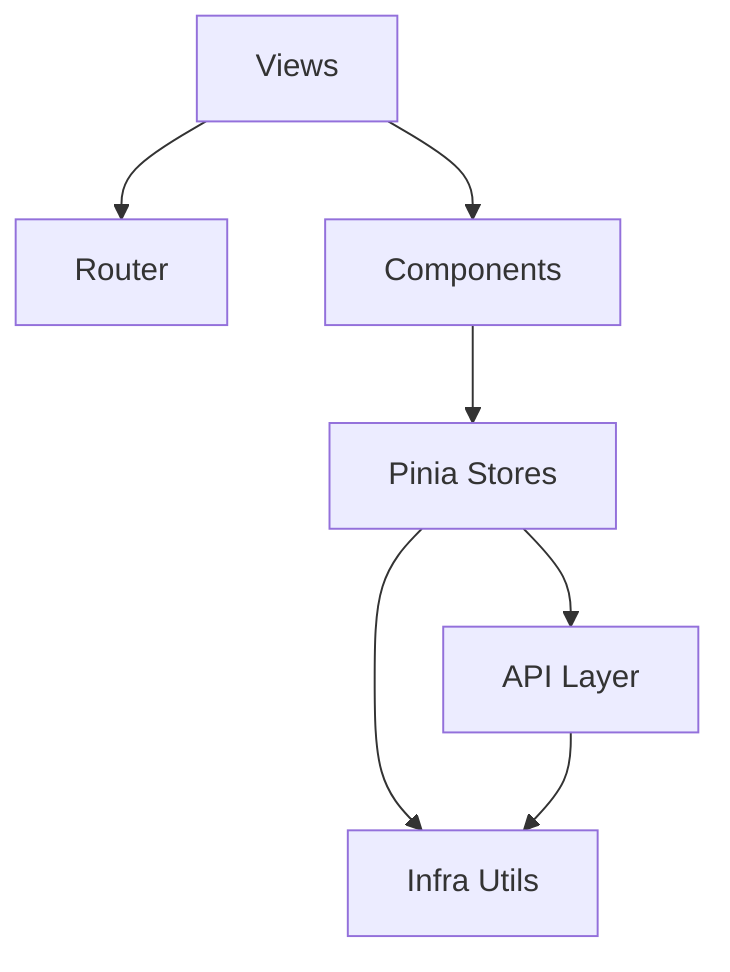

# 技术设计: Singularity Refactor（监控看板演示工程）

## 技术方案

### 核心技术
- Vue 3 + Vite
- Pinia + Vue Router
- Chart.js
- Tailwind CSS + CSS Variables Design System

### 实现要点

1. **状态管理按领域拆分**
   - 用多个小 Store 取代单一巨型 Store，避免跨域耦合。
2. **Infra utils 收敛基础能力**
   - `http`：统一超时/解析/错误结构
   - `storage`：SSR 兼容、JSON 容错
   - `datetime`：Intl 格式化替代日期库
   - `download`：原生下载替代 file-saver
3. **图标体系去依赖**
   - `AppIcon` 以内联 SVG 输出，使用 `currentColor` 与现有设计系统对齐。
4. **路由全量懒加载**
   - 页面按需加载，减少主 bundle 压力；鉴权由 `auth` store 驱动。

## 架构设计

## 架构决策 ADR

### ADR-001: 领域化 Store + Infra utils
**上下文:** 原项目存在巨型 Store 与重复工具逻辑，导致维护成本上升。  
**决策:** 按领域拆分 Store，并将通用能力收敛到 `src/utils/*`。  
**理由:** 降低耦合、提升可测试性、减少重复代码。  
**替代方案:** 继续在单 Store 内拆模块 → 拒绝原因：边界仍不清晰，耦合难以控制。  
**影响:** 初次改造文件数较多，但后续迭代成本显著下降。

### ADR-002: 图标体系改为 AppIcon（内联 SVG）
**上下文:** FontAwesome 等图标库带来额外依赖与样式引入。  
**决策:** 使用 `AppIcon` 内联 SVG 统一图标输出。  
**理由:** 包体更轻、可控性更强、与主题色更一致。  
**替代方案:** 保留 FontAwesome → 拒绝原因：依赖与 CSS 负担不符合减重目标。

## API 设计（演示）

当前 `src/api/*` 作为服务层抽象，后续可直接替换为真实后端 API：

- Alerts：读取/导出告警记录

## 数据模型

数据模型以前端状态为中心，详细结构见 `helloagents/wiki/data.md`。

## 安全与性能

- **安全**
  - 禁止硬编码敏感信息（token/密钥）；演示 token 为 mock
  - UI 层输出错误时避免泄漏内部实现细节
- **性能**
  - 路由懒加载降低首屏成本
  - 移除可由原生 API 覆盖的依赖，减少包体与解析/执行开销

## 测试与部署

- **构建验证:** `npm run build`
- **预览:** `npm run preview`
- **开发:** `npm run dev`

