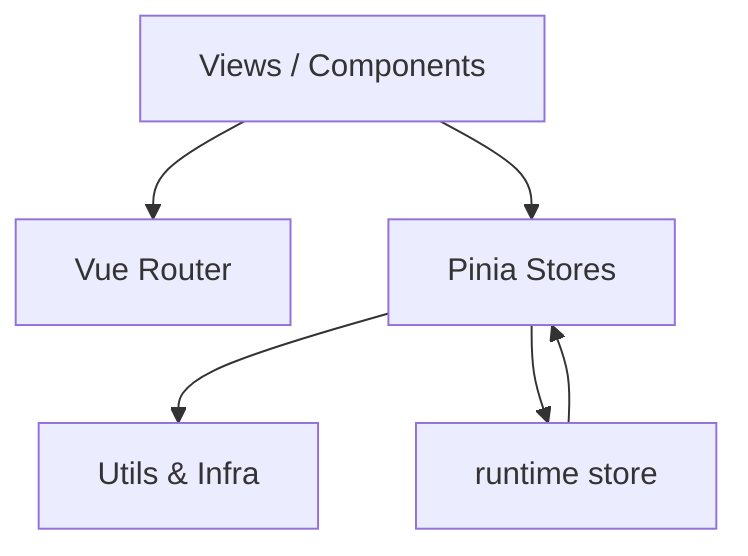

# 架构设计

## 总体架构

---

## 分层说明

### 1) Views（路由层）

- `src/views/*` 只负责页面编排、数据装配与交互流转
- 路由按页懒加载，降低首屏负担

### 2) Components（组件层）

- `src/components/*`：可复用的业务组件与模块组件
- `src/components/base/*`：基础组件（按钮/输入/图标等）统一交互与视觉

### 3) Stores（状态层）

按领域拆分，避免“巨型 Store”：

- `auth`：登录态与 token
- `theme`：主题
- `tabs`：标签页/导航态
- `users`：用户与 CRUD
- `alerts`：告警闭环 + 持久化
- `telemetry`：演示遥测（CPU/内存/进程/日志等）
- `runtime`：全局刷新编排（实时开关/间隔/最后刷新时间）
- `ui`：toast/confirm 等交互反馈

### 4) Utils（基础设施层）

原则：**能用原生能力就不用依赖**，把重复逻辑收拢为可复用工具。

- `storage`：安全 localStorage 访问（SSR 兼容、容错）
- `datetime`：基于 Intl 的格式化（减少日期工具依赖）
- `download`：原生下载封装（替代 file-saver）
- `sleep`：可控演示延迟（默认 0ms）

---

## 重大架构决策（ADR 索引）

| adr_id | title | date | status | affected_modules | details |
|--------|-------|------|--------|------------------|---------|
| ADR-001 | 领域化 Store + Infra utils | 2025-12-24 | ✅已采纳 | stores/utils | `../history/2025-12/202512242224_singularity-refactor/how.md` |
| ADR-002 | AppIcon（内联 SVG）替代外部图标库 | 2025-12-24 | ✅已采纳 | ui/components | `../history/2025-12/202512242224_singularity-refactor/how.md` |
